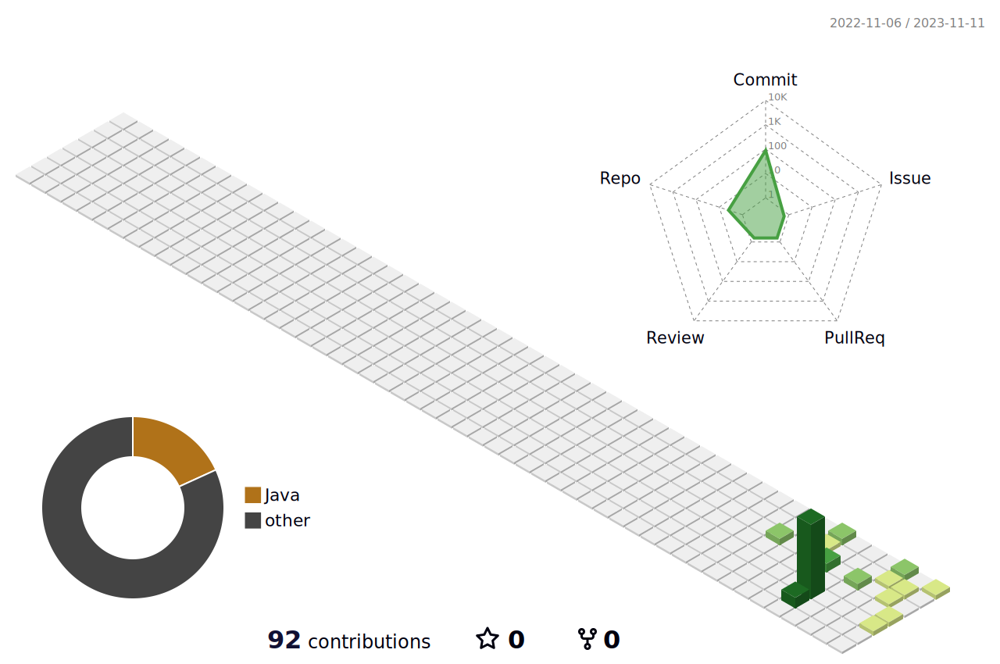

### Hi there 👋

<!--
**kimdonghyeok1352/kimdonghyeok1352** is a ✨ _special_ ✨ repository because its `README.md` (this file) appears on your GitHub profile.

Here are some ideas to get you started:

- 🔭 I’m currently working on ...
- 🌱 I’m currently learning ...
- 👯 I’m looking to collaborate on ...
- 🤔 I’m looking for help with ...
- 💬 Ask me about ...
- 📫 How to reach me: ...
- 😄 Pronouns: ...
- ⚡ Fun fact: ...
-->
<!--헤더-->

<!--총 커밋 수-->

<!--주로 작성하는 블로그-->
## 💻 DEV's log 💻

 

## 🔨 Once I've used 🔨

    <!-- Backend -->
    
<strong>Backend</strong>

    

         
         
    

    <!-- Database -->
    
<strong>Database</strong>

    

         
         
    

    <!-- Server -->
    
<strong>Server</strong>

    

        
    

    <!-- Frontend -->
    
<strong>Frontend</strong>

    

         
         
         
    

    <!-- Others -->
     

